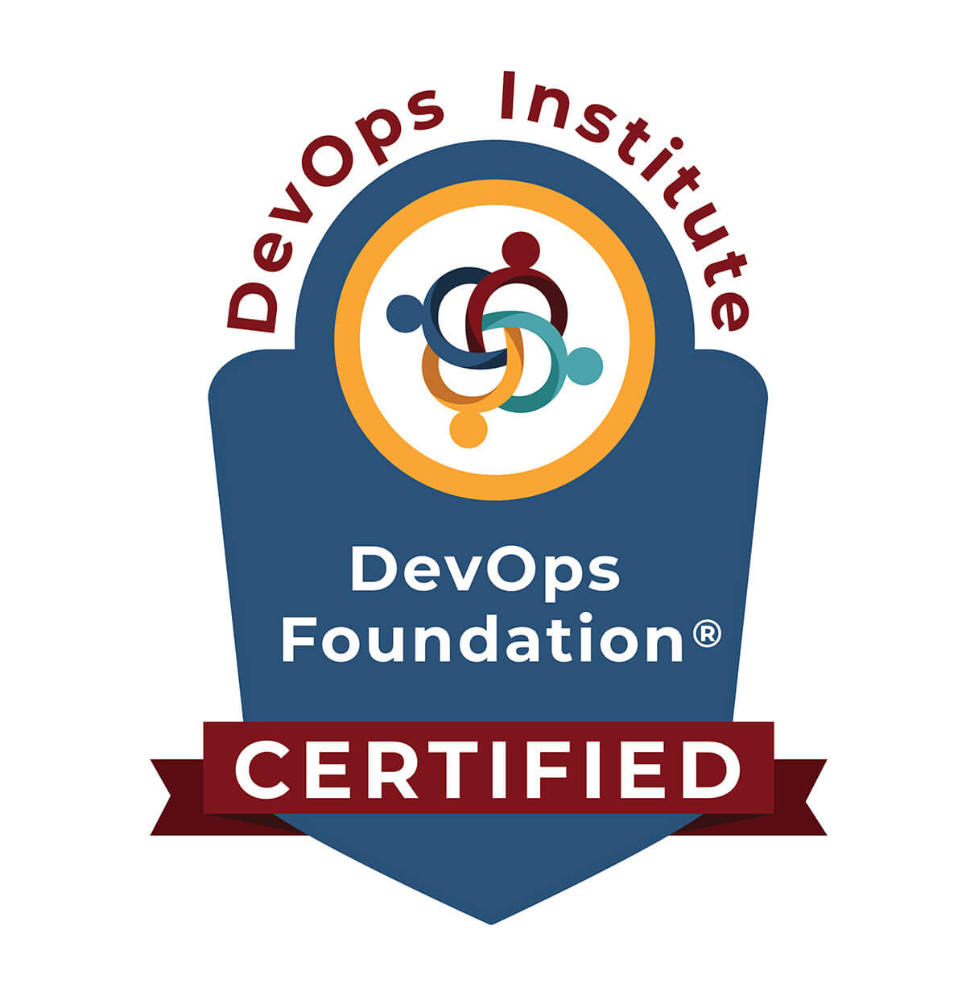

---
hide:
  - navigation
  - toc
---

#

## Work

| Role _Company_                                    | Description                                                                                                                                                                                                                                                                                                                                                                                                                                                                                                                                                                                                                                                                                                                                                                                                                                                                                                                                                                                                                                | Dates        |
| :--------------------------------------------------- | :----------------------------------------------------------------------------------------------------------------------------------------------------------------------------------------------------------------------------------------------------------------------------------------------------------------------------------------------------------------------------------------------------------------------------------------------------------------------------------------------------------------------------------------------------------------------------------------------------------------------------------------------------------------------------------------------------------------------------------------------------------------------------------------------------------------------------------------------------------------------------------------------------------------------------------------------------------------------------------------------------------------------------------------- | :----------- |
| Senior Principal Technical Architect _S&P Global_ | Work closely with members of the Product Design & Development organization, advocating design decisions to reduce the complexity, improve the resiliency and supportability of future systems. Provide technical support and problem resolution on complex and moderately complex issues. Manage small to medium-sized projects or portions of large projects and assist in resolving issues and planning for new applications and services. Worked on multiple migration from on-premises to VMC for multiple million USD products revenues. Successfully lead Tech Debt medium-sized projects, with hundreds of end users. Delivered multi-regions terraform code blueprint for a new serverless application to developers using OCTO provided modules. Contributed to OCTO modules to add features. Was Responsible for Derivexperts IT Infrastrucure product. Worked on Derivexperts DC integration to IHSMarkit Networks, remediation for applications vulnerabilities and coordinated DC Decommissions process. | 2018-Present |
| Principal Systems Engineer _Derivexperts_         | Network and systems infrastructure lead manager of a platform delivering over 2 M EUR per year. Designed and set-up an open-source scalable IT infrastructure across two regions (50+ Virtualized Linux servers) Strong emphasis on configuration management tools, security, high availability, monitoring, and alerts. Wrote and maintained the IT security policy, dispensing annual formation to employees. Established the BCP, conducting semi-annuals BCP Tests.    Leading IT projects to improve company workflow. Lead a team of one system engineer.                                                                                                                                                                                                                                                                                                                                                                                                                                                          | 2012-2018    |
| Systems Engineer _Sipartech_                      | KVM infrastructure migration to VMWare ESXI and SambaLDAP to Active Directory 2012. Created a dynamic map of the optical fiber network with real time alerts. Set-up multiple network hardware across datacenters including cisco, brocade, extreme. Lead a team of one system engineer.                                                                                                                                                                                                                                                                                                                                                                                                                                                                                                                                                                                                                                                                                                                                          | 2011-2012    |
| System Administrator consultant _Ozitem_          | Administered the day-to-day operations of the systems for large companies including Active Directory, DNS.  Created and maintained standard operating procedures for technical teams.                                                                                                                                                                                                                                                                                                                                                                                                                                                                                                                                                                                                                                                                                                                                                                                                                                                   | 2000-2011    |

## Skills

### Softwares
- AWS
- Terraform, CloudFormation
- Ansible, Puppet
- Github, Gitlab, CI/CD
- Docker, Docker Compose
- Apache, Nginx
- Zabbix, Nagios
- MySQL
- BIG IP F5, AVI Vantage

### Languages
- Shell, Python, Powershell

## Certifications

### Current
[{ width="150" }](https://www.credential.net/975b27b9-5c29-4a40-a8be-040b335b40f6?username=mathieualbertini118704){:target="_blank"}

[{ width="150" }](https://www.credly.com/badges/0bb896f5-3329-4d88-9c3a-7a18203aafcc/public_url){:target="_blank"}

### Expired
[{ width="150" }](https://www.credly.com/badges/cc9fd11b-7b1e-4e17-9824-b032ce936afd/public_url){:target="_blank"}

- Comptia Security+
- CCNA
- RHCSA
- LPIC-1
