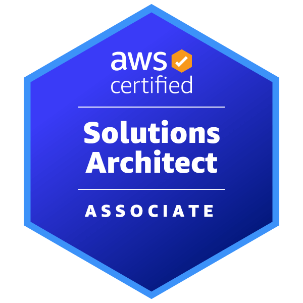
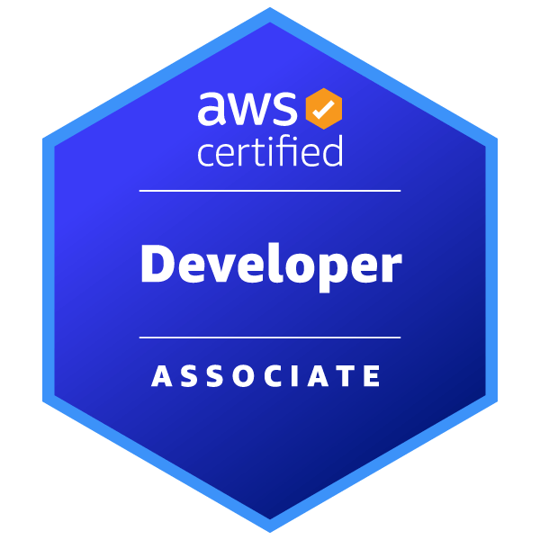

---
hide:
  - navigation
  - toc
---

#

## Work

| Role _Company_                           | Description                                                                                                                                                                                                                                                                                                                                                                                                                                                                                                                                | Dates        |
| :------------------------------------------ | :----------------------------------------------------------------------------------------------------------------------------------------------------------------------------------------------------------------------------------------------------------------------------------------------------------------------------------------------------------------------------------------------------------------------------------------------------------------------------------------------------------------------------------------- | :----------- |
| Solution Architect _S&P Global_          | Work collaboratively and cross-functionally with DevOps team and Program Management.  Support Platform Migrations and other Tech Programs.  Facilitation of POCs and assistance with technology evaluations  Cost optimization of existing platforms  Assistance with development and optimization of automation technologies and shared services                                                                                                                                                                              | 2021-Present |
| Solution Architect _IHSMarkit_           | Work closely with members of the Product Design & Development (PD&D) organization, advocating design decisions to reduce the complexity, improve the resiliency and supportability of future systems.  Provide technical support and problem resolution on complex and moderately complex issues Manage small to medium-sized projects or portions of large projects and assist in resolving issues and planning for new applications and services.                                                                                  | 2018-2021    |
| Chief Security Officer _Derivexperts_    | Designed and set-up an open-source scalable IT infrastructure across two regions with configuration management tools, strong emphasis on security, high availability, monitoring, and alerts.                                                                                              Wrote and updated the IT security policy, dispensing annual formation to employees. Established the BCP, conducting semi-annuals BCP Tests. Managed a team of one system engineer. Leading IT projects to improve company workflow. | 2012-2018    |
| System Engineer _Sipartech_              | KVM infrastructure migration to VMWare ESXI and SambaLDAP to Active Directory  Created a dynamic map of the optical fiber network with real time alerts.  Set-up multiple network hardware across the datacenters including cisco, brocade, extreme.  Managed a team of one system engineer.                                                                                                                                                                                                                                      | 2011-2012    |
| System Administrator consultant _Ozitem_ | Administered the day-to-day operations of the network for large companies including: Active Directory, Group Policy, DNS, DHCP Created and maintained standard operating procedures for the team of technicians.                                                                                                                                                                                                                                                                                                                        | 2000-2011    |

## Skills

### Softwares
- AWS
- Terraform, CloudFormation
- Puppet, Ansible
- Git, GitHub, Gitlab
- Docker
- MySQL
- Apache, Nginx
- Zabbix, Prometheus
- Red Hat, Debian
- F5 BIG-IP, AVI Vantage

### Languages
- Bash
- Python

## Certifications

[{ width="200" }](https://www.credly.com/badges/0bb896f5-3329-4d88-9c3a-7a18203aafcc/public_url){:target="_blank"}
[{ width="200" }](https://www.credly.com/badges/cc9fd11b-7b1e-4e17-9824-b032ce936afd/public_url){:target="_blank"}
